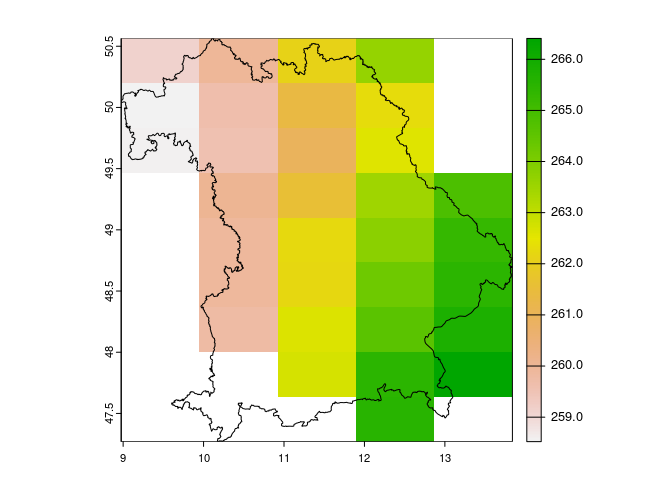

processNC: R Package for processing and analysing (large) NetCDF files
================

## Overview

`processNC` is an R package for processing and analysing NetCDF files in
R. NetCDF files can easily be loaded into R using the `rast()` function
from the `terra` package in R or formerly also using the `raster()`
function from the `raster` package. However, when trying to handle large
NetCDF files it might be more convenient to directly use the ncdf4
package or the Climate Data Operators software and this package provides
a simplified wrapper for those two options.

The need for this package arised from the task to load large NetCDF
files with global daily climate data to calculate monthly or yearly
averages. With this package this task can be achieved in a much faster
way and without having to read the entire file into memory.

### NetCDF functions

For this, the package mainly consists of two functions:

- `subsetNC()` subsets one or multiple NetCDF files by space (x,y), time
  and/or variable
- `summariseNC()` summarises one or multiple NetCDF files over time

In addition there is also a function called `cellstatsNC()`, which
calculates the spatial mean of one or multiple NetCDF files.

### Raster functions

There is also a function called `summariseRaster`, which allows a
similar implementation to the `summariseNC` function, but using any type
of raster files rather than NetCDF files. And there is also an identical
function `summariseRast`, which depends on the slightly faster `terra`
package. See benchmark example further down below for a comparison of
computation time between the three functions.

### CDO functions

There are also several functions (`filterNC`, `mergeNC` and
`aggregateNC`), which rely on the Climate Data Operators (CDO) software
(<https://code.mpimet.mpg.de/projects/cdo>).

**Note:** In order to use those functions, you need to have the CDO
software installed on your computer.

CDO is much faster than the equivalent R-functions, thus the CDO-based
functions are considerably faster than the `subsetNC()` and
`summariseNC()` functions.

## Installation

To *use* the package, it can be installed directly from GitHub using the
`remotes` package.

``` r
# If not yet installed, install the remotes package
if(!"remotes" %in% installed.packages()[,"Package"]) install.packages("remote")

# Download & Install the package from GitHub if not yet done so
if(!"processNC" %in% installed.packages()[,"Package"]) remotes::install_github("RS-eco/processNC", build_vignettes=T)
```

**If you encounter a bug or if you have any problems, please file an
[issue](https://github.com/RS-eco/processNC/issues) on Github.**

## Usage

### Load processNC & terra package

``` r
library(processNC)
library(terra)
library(raster)
library(dplyr)
```

### List NetCDF data files

``` r
# List daily temperature files for Germany from 1979 till 2016
tas_files <- list.files(paste0(system.file(package="processNC"), "/extdata"), 
                        pattern="tas.*\\.nc", full.names=T)

# Show files
basename(tas_files)
```

    [1] "tas_ewembi_deu_1979_1980.nc" "tas_ewembi_deu_1981_1990.nc"
    [3] "tas_ewembi_deu_1991_2000.nc" "tas_ewembi_deu_2001_2010.nc"
    [5] "tas_ewembi_deu_2011_2016.nc"

``` r
# List daily precipitation files for Germany from 1979 till 2016
pr_files <- list.files(paste0(system.file(package="processNC"), "/extdata"), 
                       pattern="pr.*\\.nc", full.names=T)
```

### Subset NetCDF file

``` r
# Subset NetCDF files by time and rough extent of Bavaria
subsetNC(tas_files, ext=c(8.5, 14, 47, 51), startdate=1990, enddate=1999)
```

    class       : SpatRaster 
    dimensions  : 10, 6, 3288  (nrow, ncol, nlyr)
    resolution  : 0.9166667, 0.4  (x, y)
    extent      : 8.5, 14, 47, 51  (xmin, xmax, ymin, ymax)
    coord. ref. : +proj=longlat +ellps=WGS84 +towgs84=0,0,0,0,0,0,0 +no_defs 
    source(s)   : memory
    names       : 1990-01-01, 1990-01-02, 1990-01-03, 1990-01-04, 1990-01-05, 1990-01-06, ... 
    min values  :   268.2550,   269.4496,   269.9260,   268.7616,   269.0258,   269.5515, ... 
    max values  :   272.5554,   272.0455,   272.0891,   272.1550,   273.2923,   274.2967, ... 
    time (days) : 1990-01-01 to 1999-01-01 

``` r
# Get SpatialPolygonsDataFrame of Bavaria
data(bavaria)

# Subset NetCDF file by SpatVector
r <- subsetNC(tas_files, ext=terra::vect(bavaria))
plot(r[[1]])
plot(bavaria, add=T)
```

<!-- -->

``` r
# Subset NetCDF file just by time
subsetNC(tas_files, startdate=1990, enddate=1999)
```

    class       : SpatRaster 
    dimensions  : 17, 14, 3288  (nrow, ncol, nlyr)
    resolution  : 0.6071429, 0.4117647  (x, y)
    extent      : 6.25, 14.75, 47.75, 54.75  (xmin, xmax, ymin, ymax)
    coord. ref. : +proj=longlat +ellps=WGS84 +towgs84=0,0,0,0,0,0,0 +no_defs 
    source(s)   : memory
    names       : 1990-01-01, 1990-01-02, 1990-01-03, 1990-01-04, 1990-01-05, 1990-01-06, ... 
    min values  :    268.255,    268.876,   269.7884,   268.2937,   267.8489,   268.2939, ... 
    max values  :    274.574,    274.632,   274.9313,   273.3459,   276.0111,   276.3013, ... 
    time (days) : 1990-01-01 to 1999-01-01 

### Summarise NetCDF file

``` r
# Summarise daily NetCDF file for 10 years by week
summariseNC(files=tas_files[4], startdate=2001, enddate=2010, group_col=c("week"))
```

    class       : SpatRaster 
    dimensions  : 15, 18, 530  (nrow, ncol, nlyr)
    resolution  : 0.5, 0.5  (x, y)
    extent      : 6, 15, 47.5, 55  (xmin, xmax, ymin, ymax)
    coord. ref. :  
    source(s)   : memory
    names       :   1 2001,   1 2002,   1 2003,   1 2004,   1 2005,   1 2006, ... 
    min values  : 272.2954, 264.6082, 268.2481, 266.8755, 273.0641, 268.0756, ... 
    max values  : 280.0579, 273.1299, 276.3789, 274.6424, 280.0099, 274.7085, ... 

``` r
# Summarise daily NetCDF file for 10 years by month
summariseNC(files=tas_files[4], startdate=2001, enddate=2010, group_col=c("month"))
```

    class       : SpatRaster 
    dimensions  : 15, 18, 120  (nrow, ncol, nlyr)
    resolution  : 0.5, 0.5  (x, y)
    extent      : 6, 15, 47.5, 55  (xmin, xmax, ymin, ymax)
    coord. ref. :  
    source(s)   : memory
    names       : Apr 2001, Apr 2002, Apr 2003, Apr 2004, Apr 2005, Apr 2006, ... 
    min values  : 276.3501, 277.1500,   277.65, 278.5500,   277.15, 278.3500, ... 
    max values  : 282.3499, 283.8501,   284.35, 284.7501,   284.65, 283.6499, ... 

``` r
# Summarise daily NetCDF file for 10 years by year
summariseNC(files=tas_files[4], startdate=2001, enddate=2010, group_col=c("year"))
```

    class       : SpatRaster 
    dimensions  : 15, 18, 10  (nrow, ncol, nlyr)
    resolution  : 0.5, 0.5  (x, y)
    extent      : 6, 15, 47.5, 55  (xmin, xmax, ymin, ymax)
    coord. ref. :  
    source(s)   : memory
    names       :     2001,     2002,     2003,     2004,     2005,     2006, ... 
    min values  : 279.1473, 279.6632, 279.0957, 278.6661, 278.1127, 279.0922, ... 
    max values  : 284.4210, 284.8579, 284.7202, 284.2071, 284.2196, 284.7766, ... 

``` r
# Summarise daily NetCDF file for 10 years first by week and then by year
summariseNC(files=tas_files[4], startdate=2001, enddate=2010, group_col=c("week", "year"))
```

    class       : SpatRaster 
    dimensions  : 15, 18, 53  (nrow, ncol, nlyr)
    resolution  : 0.5, 0.5  (x, y)
    extent      : 6, 15, 47.5, 55  (xmin, xmax, ymin, ymax)
    coord. ref. :  
    source(s)   : memory
    names       :        1,        2,        3,        4,        5,        6, ... 
    min values  : 269.4892, 269.5704, 270.5732, 269.6285, 270.4546, 271.3650, ... 
    max values  : 275.3027, 275.9724, 277.5657, 275.8852, 276.7980, 277.7568, ... 

``` r
# Summarise daily NetCDF file for 10 years first by month and then by year
s <- summariseNC(files=tas_files[4], startdate=2001, enddate=2010, group_col=c("month", "year"))
s
```

    class       : SpatRaster 
    dimensions  : 15, 18, 12  (nrow, ncol, nlyr)
    resolution  : 0.5, 0.5  (x, y)
    extent      : 6, 15, 47.5, 55  (xmin, xmax, ymin, ymax)
    coord. ref. :  
    source(s)   : memory
    names       : January, February,  March,  April,    May,   June, ... 
    min values  :  269.81,   271.11, 274.13, 278.36, 283.22, 286.39, ... 
    max values  :  276.14,   277.16, 280.17, 284.59, 288.88, 292.26, ... 

``` r
plot(s[[1]])
```

<!-- -->

``` r
# Summarise daily NetCDF files for all years
yearly_tas <- summariseNC(tas_files, startdate=2000, enddate=2016, group_col="year")
yearly_tas
```

    class       : SpatRaster 
    dimensions  : 15, 18, 17  (nrow, ncol, nlyr)
    resolution  : 0.5, 0.5  (x, y)
    extent      : 6, 15, 47.5, 55  (xmin, xmax, ymin, ymax)
    coord. ref. :  
    source(s)   : memory
    names       :     2000,     2001,     2002,     2003,     2004,     2005, ... 
    min values  : 279.9609, 279.1473, 279.6632, 279.0957, 278.6661, 278.1127, ... 
    max values  : 285.1134, 284.4210, 284.8579, 284.7202, 284.2071, 284.2196, ... 

``` r
yearly_pr <- summariseNC(pr_files, startdate=2000, enddate=2016, group_col="year")
yearly_pr
```

    class       : SpatRaster 
    dimensions  : 15, 18, 17  (nrow, ncol, nlyr)
    resolution  : 0.5, 0.5  (x, y)
    extent      : 6, 15, 47.5, 55  (xmin, xmax, ymin, ymax)
    coord. ref. :  
    source(s)   : memory
    names       :       2000,       2001,       2002,       2003,       2004,       2005, ... 
    min values  : 0.00000000, 0.00000000, 0.00000000, 0.00000000, 0.00000000, 0.00000000, ... 
    max values  : 0.02125388, 0.02209105, 0.02318245, 0.01517012, 0.01880114, 0.02133196, ... 

``` r
plot(yearly_tas[[1]])
```

<!-- -->

``` r
# Calculate mean annual temperature for Germany
yearmean_tas <- as.data.frame(terra::global(yearly_tas, fun="mean", na.rm=T))
colnames(yearmean_tas) <- "mean"
yearmean_tas <- tibble::rownames_to_column(yearmean_tas, var="year")
yearmean_tas$year <- sub("X", "", yearmean_tas$year)
yearmean_tas$mean <- yearmean_tas$mean - 273.15
head(yearmean_tas)
```

      year      mean
    1 2000 10.213450
    2 2001  9.327813
    3 2002  9.823712
    4 2003  9.659545
    5 2004  9.237923
    6 2005  9.365806

``` r
# Calculate mean total precipitation for Germany
yearmean_pr <- as.data.frame(terra::global(yearly_pr, fun="mean", na.rm=T))
colnames(yearmean_pr) <- "mean"
yearmean_pr <- tibble::rownames_to_column(yearmean_pr, var="year")
yearmean_pr$year <- sub("X", "", yearmean_pr$year)
yearmean_pr$mean <- yearmean_pr$mean #- 273.15
head(yearmean_pr)
```

      year        mean
    1 2000 0.007102034
    2 2001 0.007969856
    3 2002 0.008777291
    4 2003 0.005238077
    5 2004 0.006979942
    6 2005 0.006719711

### Summarise NetCDF file using CDO commands

- Filter years

``` r
temp <- tempfile(fileext=".nc")
filterNC(file=tas_files[2], startdate=1985, enddate=1990, outfile=temp)
```

    Created file /tmp/Rtmp27GP5b/file319c6c3320e5.nc.

``` r
terra::rast(temp)
```

    class       : SpatRaster 
    dimensions  : 15, 18, 2191  (nrow, ncol, nlyr)
    resolution  : 0.5, 0.5  (x, y)
    extent      : 6, 15, 47.5, 55  (xmin, xmax, ymin, ymax)
    coord. ref. : lon/lat WGS 84 
    source      : file319c6c3320e5.nc 
    varname     : tas 
    names       :  tas_1,  tas_2,  tas_3,  tas_4,  tas_5,  tas_6, ... 
    unit        : Kelvin, Kelvin, Kelvin, Kelvin, Kelvin, Kelvin, ... 
    time (days) : 1985-01-01 to 1990-12-31 

- Merge files:

``` r
temp <- tempfile(fileext=".nc")
mergeNC(files=tas_files, outfile=temp)
```

    Created file /tmp/Rtmp27GP5b/file319c26756533.nc.

``` r
terra::rast(temp)
```

    class       : SpatRaster 
    dimensions  : 15, 18, 13880  (nrow, ncol, nlyr)
    resolution  : 0.5, 0.5  (x, y)
    extent      : 6, 15, 47.5, 55  (xmin, xmax, ymin, ymax)
    coord. ref. : lon/lat WGS 84 
    source      : file319c26756533.nc 
    varname     : tas 
    names       :  tas_1,  tas_2,  tas_3,  tas_4,  tas_5,  tas_6, ... 
    unit        : Kelvin, Kelvin, Kelvin, Kelvin, Kelvin, Kelvin, ... 
    time (days) : 1979-01-02 to 2017-01-01 

- Aggregate files:

``` r
temp2 <- tempfile(fileext=".nc")
aggregateNC(infile=temp, outfile=temp2, group_col="month", var="tas", startdate="2000", enddate="2009")
```

    Created file /tmp/Rtmp27GP5b/file319c1a835a83.nc.

``` r
temp2 <- terra::rast(temp2)
temp2
```

    class       : SpatRaster 
    dimensions  : 15, 18, 10  (nrow, ncol, nlyr)
    resolution  : 0.5, 0.5  (x, y)
    extent      : 6, 15, 47.5, 55  (xmin, xmax, ymin, ymax)
    coord. ref. : lon/lat WGS 84 
    source      : file319c1a835a83.nc:tas 
    varname     : tas 
    names       :  tas_1,  tas_2,  tas_3,  tas_4,  tas_5,  tas_6, ... 
    unit        : Kelvin, Kelvin, Kelvin, Kelvin, Kelvin, Kelvin, ... 
    time (days) : 2000-07-01 to 2009-07-02 

``` r
names(temp2) <- 2000:2009
time(temp2) <- lubridate::year(time(temp2))
plot(temp2)
```

<!-- -->

### Summarise Raster file

This can be achieved using:

``` r
summariseRaster(tas_files[4], startdate=2001, enddate=2010, var="tas")
```

    class      : RasterBrick 
    dimensions : 15, 18, 270, 12  (nrow, ncol, ncell, nlayers)
    resolution : 0.5, 0.5  (x, y)
    extent     : 6, 15, 47.5, 55  (xmin, xmax, ymin, ymax)
    crs        : +proj=longlat +datum=WGS84 +no_defs 
    source     : memory
    names      :  January, February,    March,    April,      May,     June,     July,   August, September,  October, November, December 
    min values : 269.8396, 271.0432, 273.9367, 278.2057, 283.1849, 286.2067, 288.3307, 287.7344,  283.7335, 280.3433, 275.1130, 270.7514 
    max values : 276.1422, 277.0875, 280.0108, 284.4274, 288.8376, 292.0917, 294.0858, 293.1610,  289.0893, 284.8109, 280.7387, 276.4388 
    months     : 1, 2, 3, 4, 5, 6, 7, 8, 9, 10, 11, 12 

or:

``` r
summariseRast(tas_files[4], startdate=2001, enddate=2010, var="tas")
```

    class       : SpatRaster 
    dimensions  : 15, 18, 12  (nrow, ncol, nlyr)
    resolution  : 0.5, 0.5  (x, y)
    extent      : 6, 15, 47.5, 55  (xmin, xmax, ymin, ymax)
    coord. ref. : lon/lat WGS 84 
    source(s)   : memory
    names       :  January, February,    March,    April,      May,     June, ... 
    min values  : 269.8396, 271.0432, 273.9367, 278.2057, 283.1849, 286.2067, ... 
    max values  : 276.1422, 277.0875, 280.0108, 284.4274, 288.8376, 292.0917, ... 
    time (raw)  : 1 to 12 

**Note:** This should give the same output as the summariseNC()
function!!!

#### Comparing computation time

``` r
library(rbenchmark)
benchmark("summariseNC" = {summariseNC(tas_files[4], startdate=2001, enddate=2010, 
                                       group_col=c("year", "month"))},
          "summariseRast" = {summariseRast(tas_files[4], startdate=2001, enddate=2010, var="tas")},
          "summariseRaster" = {summariseRaster(tas_files[4], startdate=2001, enddate=2010, var="tas")}, 
          replications=1, columns = c("test", "elapsed", "replications", "relative", "user.self", "sys.self"))
```

                 test elapsed replications relative user.self sys.self
    1     summariseNC  29.908            1    6.871     0.312    0.280
    2   summariseRast  59.801            1   13.738    59.786    0.016
    3 summariseRaster   4.353            1    1.000     4.241    0.108

#### Comparing results

``` r
sumNC <- summariseNC(tas_files[4], startdate=2001, enddate=2010, group_col=c("year", "month"))
sumNC <- summary(sumNC[[1]])
sumRast <- summariseRast(tas_files[4], startdate=2001, enddate=2010, var="tas")
sumRast <- summary(sumRast[[1]])
sumRaster <- summariseRaster(tas_files[4], startdate=2001, enddate=2010, var="tas")
sumRaster <- summary(terra::rast(sumRaster[[1]]))

sum_df <- data.frame(sumNC=sumNC,sumRast=sumRast,sumRaster=sumRaster) %>%
  select(sumNC.Freq, sumRast.Freq, sumRaster.Freq)
colnames(sum_df) <- c("sumNC", "sumRast", "sumRaster")
sum_df %>% knitr::kable()
```

| sumNC         | sumRast       | sumRaster     |
|:--------------|:--------------|:--------------|
| Min. :269.8   | Min. :269.8   | Min. :269.8   |
| 1st Qu.:272.7 | 1st Qu.:272.7 | 1st Qu.:272.7 |
| Median :273.6 | Median :273.5 | Median :273.5 |
| Mean :273.6   | Mean :273.6   | Mean :273.6   |
| 3rd Qu.:274.5 | 3rd Qu.:274.5 | 3rd Qu.:274.5 |
| Max. :276.1   | Max. :276.1   | Max. :276.1   |
| NA’s :81      | NA’s :81      | NA’s :81      |

### CellStats NetCDF file

``` r
# Summarise daily NetCDF file for 16 years and show first 6 values
head(cellstatsNC(tas_files, startdate=2000, enddate=2016))
```

          mean       date
    1 273.7878 2000-01-01
    2 274.9809 2000-01-02
    3 275.6813 2000-01-03
    4 276.3606 2000-01-04
    5 277.3515 2000-01-05
    6 277.0308 2000-01-06

``` r
# Summarise daily NetCDF files without time limit
mean_daily_temp <- cellstatsNC(tas_files, stat="mean")
mean_daily_prec <- cellstatsNC(pr_files, stat="mean")

# Summarise yearly mean temperature of Germany 
mean_daily_temp$year <- lubridate::year(mean_daily_temp$date)
mean_daily_temp$mean <- mean_daily_temp$mean - 273.15
mean_annual_temp <- aggregate(mean ~ year, mean_daily_temp, mean)

# Summarise yearly total precipitation of Germany 
mean_daily_prec$year <- lubridate::year(mean_daily_prec$date)
mean_daily_prec$mean <- mean_daily_prec$mean #- 273.15
mean_annual_prec <- aggregate(mean ~ year, mean_daily_prec, sum)

library(ggplot2); library(patchwork)
p1 <- ggplot() + geom_line(data=mean_annual_temp, aes(x=year, y=mean)) +
  theme_bw() + labs(x="Year", y="Annual mean temperature (°C)") + ggtitle("Germany")
p2 <- ggplot() + geom_line(data=mean_annual_prec, aes(x=year, y=mean)) +
  theme_bw() + labs(x="Year", y="Annual total precipitation")
p1 / p2
```

<!-- -->
